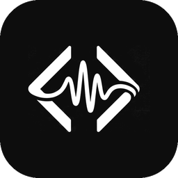

<p align="center">
  
</p>

# Levity

**Voice-driven AI development — talk to your coding assistant and hear it talk back.**

Levity is a hands-free voice layer for AI-assisted development. It captures your
voice, transcribes it locally with [Whisper](https://github.com/openai/whisper),
and speaks responses aloud using a two-tier text-to-speech engine (a fast local
system voice, with an optional cloud upgrade via Gemini 2.5 Flash TTS).

The project ships **two independent components** — use either or both:

| Component | What it is | Use it when |
| :-- | :-- | :-- |
| [`levity-voice-mcp`](#1-levity-voice-mcp-claude-desktop-antigravity-ide-and-standalone-antigravityapp) | An [MCP](https://modelcontextprotocol.io) server that gives **Claude Desktop**, **Antigravity IDE**, and **standalone Google Antigravity.app (Agentic)** a voice. | You want to talk to your AI assistants hands-free. |
| [`antigravity-voice`](#2-antigravity-voice-vs-code-extension) | A **VS Code / Antigravity** extension with its own STT, TTS, wake-word, and settings UI. | You want voice control inside your editor. |

Both share the same design: **local-first, bring-your-own-key (BYOK), no telemetry.**

---

## Platform support

The `levity-voice-mcp` server is **cross-platform**. It auto-detects the OS and
uses the native speech engine on each:

| Platform | Status | Speech engine |
| :-- | :-- | :-- |
| **macOS** | ✅ Supported | `say` + `afplay` (built in) |
| **Windows 11** | ✅ Supported | PowerShell `System.Speech` (SAPI) + `System.Media.SoundPlayer` (built in) |
| **Linux** | ✅ Supported | `espeak-ng`/`espeak` (`sudo apt install espeak-ng`) + `aplay`/`paplay`/`ffplay` |

Speech-to-text for `voice_confirm` uses Whisper, which runs on all three. The
older `antigravity-voice` VS Code extension is still macOS-focused; the
cross-platform support above applies to the MCP server.

---

## Prerequisites

Shared across both components:

- **Python 3.9+** on your `PATH` (`python3 --version`).
- **A working microphone**, and permission for your terminal / editor / Claude
  Desktop to access it (macOS: System Settings → Privacy & Security → Microphone).
- **~150 MB–1.5 GB disk** for the Whisper model (downloaded on first run; size
  depends on the model you choose — `base` is ~140 MB).
- **Xcode Command Line Tools** on macOS (`xcode-select --install`) — needed to
  build some audio dependencies.

Optional, depending on features you enable:

- **Gemini API key** (free tier available at
  [aistudio.google.com](https://aistudio.google.com/app/apikey)) — enables the
  higher-quality cloud TTS voice and, in the extension, AI command processing.
  Without it, everything falls back to the local system voice.
- **Picovoice access key** (free at [console.picovoice.ai](https://console.picovoice.ai/))
  — only the **`antigravity-voice` extension's** wake-word mode needs this. The
  MCP server has no wake-word; it's TTS plus on-demand `voice_confirm`.
- **A speech engine on Linux** — `sudo apt install espeak-ng`. macOS and Windows
  use built-in engines.

---

## 1. `levity-voice-mcp` (Claude Desktop, Antigravity IDE, and Standalone Antigravity.app)

A lightweight MCP server exposing voice tools to Claude Desktop, the **Antigravity IDE**, and the **standalone Google Antigravity.app (Agentic)**:

- `voice_speak` — speak text aloud (native system voice, or Gemini 2.5 Flash
  TTS for longer replies). Returns immediately; audio plays in the background.
- `voice_confirm` — **quick** spoken yes/no (≤5s, Whisper STT) → `yes`/`no`/`unclear`
  for hands-free approvals (e.g. "should I run this?"). Only proceed on `yes`.
- `voice_listen` — **full** free-form listening (up to 30s, Whisper STT) → returns
  the raw transcript, so you can answer anything ("let's go with option A").
- `voice_toggle` — start/stop the server, toggle voice responses, set listen mode,
  check status.

**Response modes.** A `listen_mode` preference (`quick` or `full`) — toggled from
the menu bar's **Response Mode** item — tells the assistant which style you prefer:
`quick` favors `voice_confirm` (yes/no), `full` favors `voice_listen` (free-form).

### Setup and Deployment

#### Step 1: Install & Create Virtual Environment

##### One-Click Install (macOS)
In Finder, open the `levity-voice-mcp/` folder and **double-click `install.command`.**
This will automatically create your local virtual environment, install dependencies, copy the server scripts to a stable path at `~/.levity-voice/`, and register the server inside your Claude Desktop configuration.

##### Manual Setup (macOS/Linux Scripted)
Or, perform a manual installation in your terminal:
```bash
cd levity-voice-mcp
./setup.sh          # creates ~/.levity-voice/venv and installs deps
```
*Note: This script copies `server.py` and `menubar.py` into your home directory under `~/.levity-voice/` for stable referencing.*

#### Step 2: Register the MCP Server

Depending on which environment(s) you use, copy the following configuration block into the corresponding config file:

##### A. Claude Desktop
Add to `~/Library/Application Support/Claude/claude_desktop_config.json`:
```json
{
  "mcpServers": {
    "levity-voice": {
      "command": "/Users/YOUR_USERNAME/.levity-voice/venv/bin/python",
      "args": ["/Users/YOUR_USERNAME/.levity-voice/server.py"]
    }
  }
}
```

##### B. Antigravity IDE
Add to `~/.gemini/antigravity-ide/mcp_config.json`:
```json
{
  "mcpServers": {
    "levity-voice": {
      "command": "/Users/YOUR_USERNAME/.levity-voice/venv/bin/python",
      "args": ["/Users/YOUR_USERNAME/.levity-voice/server.py"]
    }
  }
}
```

##### C. Standalone Google Antigravity.app (Agentic)
Add to `~/.gemini/antigravity/mcp_config.json`:
```json
{
  "mcpServers": {
    "levity-voice": {
      "command": "/Users/YOUR_USERNAME/.levity-voice/venv/bin/python",
      "args": ["/Users/YOUR_USERNAME/.levity-voice/server.py"]
    }
  }
}
```
*(Make sure to replace `YOUR_USERNAME` with your actual macOS/Linux account name).*

#### Step 3: Run and Control the System

Once registered, restart your respective application (Claude Desktop, Antigravity IDE, or Antigravity.app). 

##### Interactive macOS Menu-Bar App
The server **launches the menu bar automatically** (macOS) — whenever the voice
server starts (host launch, or when you start the voice service) the 🎙 Levity
icon appears. A single-instance guard prevents duplicate icons across Claude
Desktop / Antigravity. Disable with `"auto_menubar": false` in
`~/.levity-voice/config.json`.

To start it by hand (e.g. before the server runs):
```bash
~/.levity-voice/venv/bin/python ~/.levity-voice/menubar.py
```
For a Login Item, click **"Launch at Login"** in the menu. (An optional
double-click app can be built with `build-app.command`, but the automatic
launch above is the recommended path.)

This shows the **Levity status-bar icon** at the top-right of your screen:
- **Response Mode** — choose **Quick (Yes/No)** or **Full (Free-form)** input.
- **Server: ON/OFF** — start or stop the voice server.
- **Voice Response: ON/OFF** — mute/unmute spoken responses.
- **Restart Server** — reload the server in place (picks up updated `server.py`).

##### Direct Agent Prompts
You can also direct your AI assistant to control the voice engine by typing or saying:
* *"Start the voice server."*
* *"Mute voice responses."*
* *"Ask me to confirm before running that."* (uses `voice_confirm`)

---

### Configuration

Settings live in `~/.levity-voice/config.json` (created on first run). Notable keys:

| Key | Default | Meaning |
| :-- | :-- | :-- |
| `whisper_model` | `base` | `tiny` / `base` / `small` / `medium` — accuracy vs speed (used by `voice_confirm`/`voice_listen`). |
| `listen_mode` | `quick` | `quick` (yes/no) or `full` (free-form). Set from the menu bar. |
| `local_voice` | platform default | System voice name. macOS: `say -v '?'`; Windows: SAPI voice name; Linux: espeak voice. |
| `gemini_api_key` | `""` | Set to enable cloud TTS (or use the `GEMINI_API_KEY` env var / `~/.levity-voice/.env`). |
| `gemini_voice` | `Kore` | Gemini TTS persona. |

Config changes are hot-reloaded — the running server picks them up without a restart.

---

## 2. `antigravity-voice` (VS Code extension)

A full voice assistant inside the editor: **Listen → Transcribe → Think → Speak.**
With a Gemini key it answers coding questions with awareness of your active file;
without one it echoes back your transcription.

### Install (development build)

```bash
cd antigravity-voice
npm install
npm run compile        # builds ./out
npm run setup-sidecar  # creates sidecar/.venv and installs Python deps
```

Then press **F5** in VS Code to launch an Extension Development Host, or package
a `.vsix` with [`vsce`](https://github.com/microsoft/vscode-vsce):

```bash
npx vsce package
```

### Usage

- **Hotkey:** `Cmd+Alt+V` (macOS) / `Ctrl+Alt+V` (Windows/Linux) to start/stop.
- **Command Palette:** search "Antigravity" for all commands.
- **Settings:** run *"Antigravity: Open Voice Settings"* for a visual config panel,
  or edit `antigravity.*` keys in VS Code settings.
- **API keys:** *"Antigravity: Set Gemini API Key"* / *"Set Picovoice Access Key"* —
  stored securely in the OS keychain via VS Code SecretStorage, never on disk.

### Trigger modes

- **Tap-to-talk** — press the hotkey to start, press again (or pause) to stop.
- **Wake word** — always-on detection; say the keyword to start (needs a Picovoice key).

---

## Wake word

Wake-word activation lives only in the **`antigravity-voice` extension**, via
**Picovoice Porcupine** (free access key, supports custom `.ppn` keywords). The
`levity-voice-mcp` server is intentionally TTS plus on-demand `voice_confirm` —
hands-free input there comes from your assistant's own voice input or
`voice_confirm`, not an always-on wake word.

---

## Voice input & dictation

Levity captures your spoken answers with its **own Whisper engine**
(`voice_confirm` / `voice_listen`) — it does **not** depend on any third-party
dictation app (e.g. Dictaflow) or on macOS Dictation. Nothing extra is required
for Levity's voice features to work.

If you also like to **dictate your typed chat messages**, that's separate from
Levity: use whatever you prefer. If you don't have a tool like Dictaflow, macOS
**Dictation** is built in (System Settings → Keyboard → Dictation) and works out
of the box — Levity neither requires nor manages it.

---

## Guaranteed voice output

You can make Levity speak **every** completed response, not just when the model
remembers to. How strong that guarantee is depends on the runtime, because a
true guarantee has to run when a turn ends — outside the model's control.

| Runtime | Mechanism | Guarantee |
| :-- | :-- | :-- |
| **Claude Code / Cowork** | `Stop` hook (`levity-voice-mcp/hooks/`) — cross-platform | ✅ Every turn, unless muted or no TTS engine |
| **Antigravity extension** | in-code `TTSProvider.speak()` after each turn | ✅ Every turn, unless muted |
| **Claude Desktop** | model calls `voice_speak` | ⚠️ Best-effort — Desktop has no hook system |

- **Claude Code / Cowork:** install the Stop hook (see
  [`levity-voice-mcp/hooks/README.md`](./levity-voice-mcp/hooks/README.md)). It
  reads the final assistant message and speaks it deterministically. A
  `last_spoken.json` marker prevents double-speak when the model also voiced the
  turn.
- **Claude Desktop:** there is no post-turn hook, so spoken output relies on the
  model calling `voice_speak` (the server's tool instructions strongly enforce
  this). `voice_speak` now returns immediately and plays audio in the
  background, so long replies no longer time out and silently drop.
- **Mute anytime:** say "voice off" (runs `voice_toggle response_off`) or set
  `response_active: false` in `~/.levity-voice/config.json`. Every mechanism
  honors this switch.

## Skill & Cowork plugin

- **Skill** (`levity-voice-mcp/skill/SKILL.md`) — lets the assistant start and
  drive the voice loop on command ("start voice"). Installed for Antigravity
  under `~/.gemini/config/skills` and `global_skills`.
- **Cowork plugin** (`cowork-plugin/levity-voice/`) — packages that skill for
  Claude Desktop's plugin system; build a `.plugin` to install it there. It's
  skill-only (it uses your existing `levity-voice` MCP rather than adding a
  second server).

Levity currently runs as a **single active voice server** — one host at a time
(a PID lock prevents multiple processes fighting over the mic). Running it across
**multiple hosts simultaneously** is designed in
[`docs/multi-host-voice-daemon.md`](./docs/multi-host-voice-daemon.md).

## Privacy & security

- **Speech-to-text runs locally** (Whisper) — your audio is not sent anywhere
  unless you explicitly enable cloud TTS.
- **API keys are stored in the OS keychain** (extension) or your local config
  file (MCP server) — never committed to the repo and never logged.
- **No analytics or telemetry.**

---

## Platform notes

The MCP server detects the OS at startup (`platform.system()`) and routes TTS
accordingly — no configuration needed:

- **Windows:** speech via PowerShell `System.Speech`; all subprocesses launch
  with `CREATE_NO_WINDOW` so no console flashes. Self-restart uses
  `Popen` + `os._exit` (since `os.execv` doesn't replace in place on Windows).
- **Linux:** install a speech engine — `sudo apt install espeak-ng` — and an
  audio player (`aplay`/`paplay`/`ffplay`, usually already present).
- **macOS:** works out of the box.

The older `antigravity-voice` VS Code extension has not yet been ported and
remains macOS-focused.

---

## Roadmap

- **Multi-host voice daemon** — run Levity in Claude Desktop + Antigravity
  simultaneously via a shared daemon + per-host shims
  ([design](./docs/multi-host-voice-daemon.md)).
- Port the `antigravity-voice` extension to the cross-platform engine.
- Fully offline AI tier (local LLM via Ollama for command interpretation).
- Pinned dependency versions for reproducible installs.

---

## License

[MIT](./LICENSE) © 2026 Anthony Guidry
